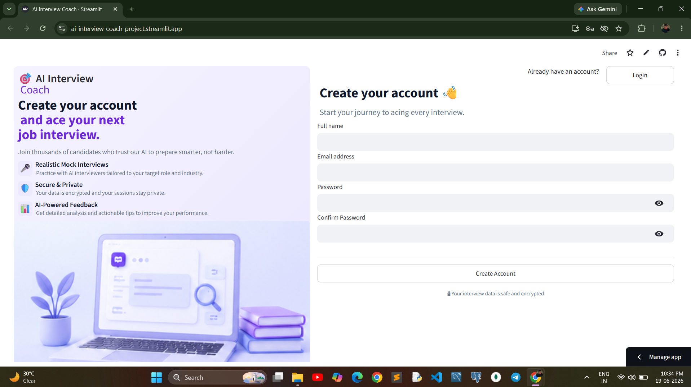
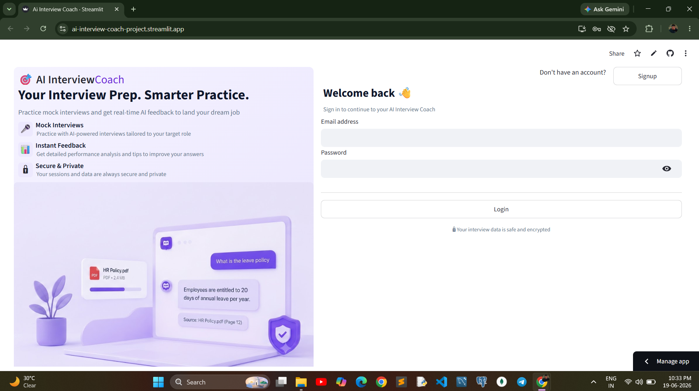
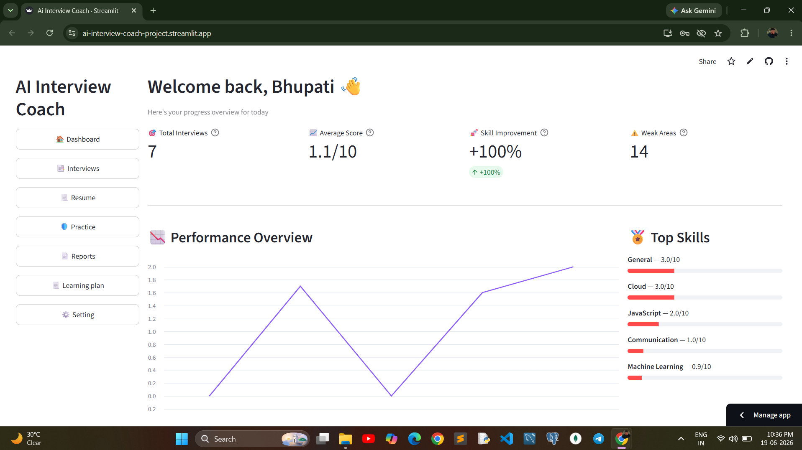
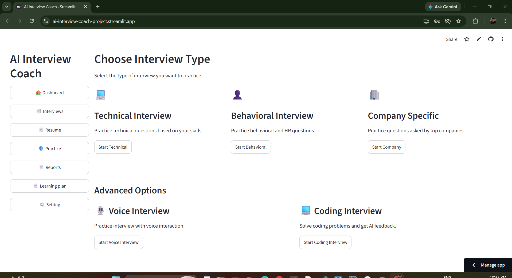
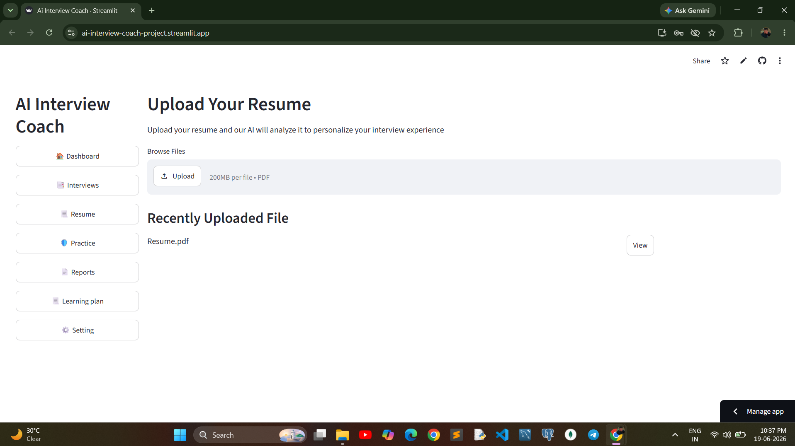
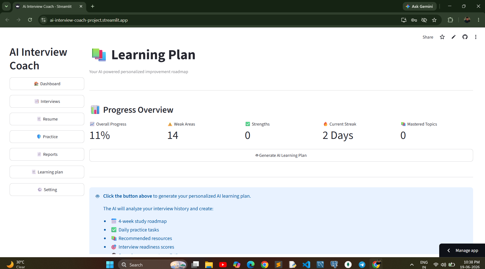
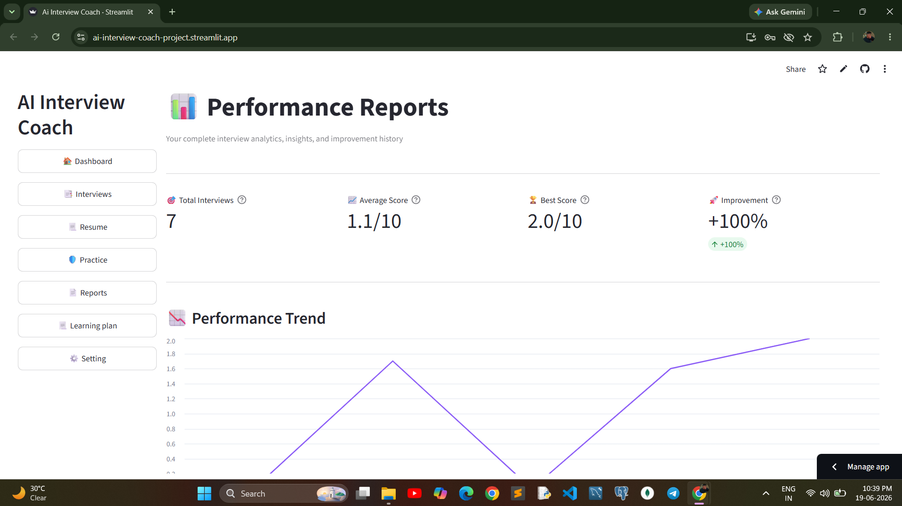
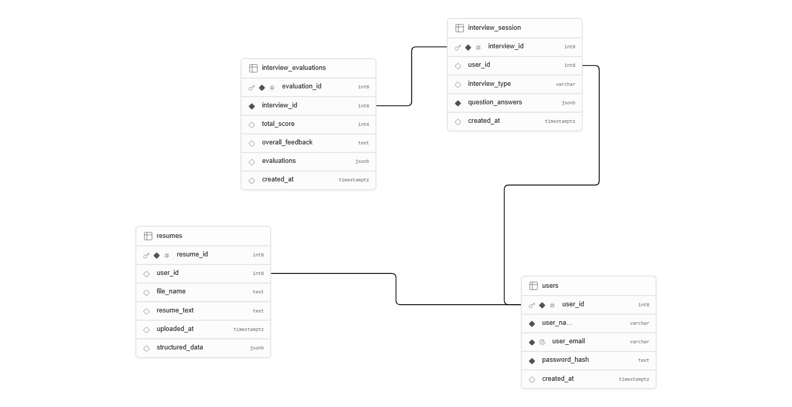

<div align="center">
 <h1>🎯 AI Interview Coach</h1>
 
**Practice mock interviews. Get real-time AI feedback. Land your dream job.**
 
[](https://www.python.org/)
[](https://streamlit.io/)
[](https://supabase.com/)
[](https://www.langchain.com/)
[](LICENSE)
 
[Live Demo](https://ai-interview-coach-project.streamlit.app/) · [Report Bug](https://github.com/BhupatiNadar/ai-interview-coach/issues) · [Request Feature](https://github.com/BhupatiNadar/ai-interview-coach/issues)
 
</div>
---
 
## 📖 Overview
 
**AI Interview Coach** is a full-stack, AI-powered mock interview platform built with **Streamlit**. It analyzes a candidate's resume, generates personalized interview questions across multiple formats (Technical, Behavioral, Coding, Company-Specific, and **Voice**), evaluates answers using LLM-driven scoring, and turns every session into actionable insight — a performance dashboard, skill-gap reports, and an AI-generated 4-week learning roadmap.
 
It's designed to feel like a real interview prep coach: upload your resume once, and every question, evaluation, and recommendation downstream is tailored to *you*.
 
---
 
## ✨ Key Features
 
| Feature | Description |
|---|---|
| 🔐 **Secure Authentication** | Email/password signup & login with `bcrypt` password hashing, backed by Supabase |
| 📄 **Resume Parsing** | Upload a PDF resume — an LLM agent extracts skills, experience, and projects into structured data |
| 💻 **Technical Interviews** | 10 questions generated from your resume's skills, projects, and tech stack |
| 🗣️ **Behavioral Interviews** | STAR-method (Situation, Task, Action, Result) focused questions with STAR-aware evaluation |
| 🏢 **Company-Specific Interviews** | Enter a target company + role — questions are tailored to that company's culture and interview style |
| 🧑‍💻 **Coding Interviews** | 5 DSA-style coding problems matched to your resume's skill level |
| 🎙️ **Voice Interview Mode** | Hands-free, fully voice-driven interview using a custom JS component (speech synthesis + speech recognition) — no typing required |
| 🤖 **AI Evaluation Engine** | Every answer is scored 0–10 with detailed feedback and improvement tips via LLM (Llama 3.1 8B Instruct) |
| 📊 **Dashboard** | Live stats: total interviews, average score, skill improvement %, weak-area count, performance trend chart, recent sessions |
| 📚 **AI Learning Plan** | Auto-generated 4-week roadmap, daily practice tasks, curated resources, 30-day score prediction, and company-readiness scores (FAANG / Mid-size / Startups) |
| 🛡️ **Practice Center** | Stand-alone practice mode across 8 categories (Technical, Behavioral, System Design, Communication, Aptitude, HR, Coding, General) with instant AI feedback and a daily challenge |
| 📈 **Reports** | Full performance history, skills breakdown, interview-to-interview comparison, AI-generated insights, and downloadable text reports |
 
---
 
## 🖼️ Screenshots
 
 
<table>
  <tr>
    <td align="center"><b>🔐 Login / Signup</b></td>
    <td align="center"><b>📊 Dashboard</b></td>
  </tr>
  <tr>
    <td></td>
    <td></td>
  </tr>
  <tr>
    <td align="center"><b>💻 Technical Interview</b></td>
    <td align="center"><b>🎙️ Voice Interview</b></td>
  </tr>
  <tr>
    <td></td>
    <td></td>
  </tr>
  <tr>
    <td align="center"><b>📄 Resume Analysis</b></td>
    <td align="center"><b>📚 Learning Plan</b></td>
  </tr>
  <tr>
    <td></td>
    <td></td>
  </tr>
  <tr>
    <td align="center"><b>📈 Reports</b></td>
    <td align="center"><b>🗄️ Database (Supabase)</b></td>
  </tr>
  <tr>
    <td></td>
    <td></td>
  </tr>
</table>
---
 
## 🏗️ Tech Stack
 
**Frontend / App Framework**
- [Streamlit](https://streamlit.io/) — UI & app framework
- Custom HTML/JS Streamlit component for the Voice Interview (Web Speech API)
**Backend / AI**
- [LangChain](https://www.langchain.com/) + `langchain-openai` — LLM orchestration with structured (JSON-mode) output
- **Llama 3.1 8B Instruct** via the Hugging Face Inference Router — question generation & answer evaluation
- `pydantic` — structured data models for all AI agent outputs
**Database & Auth**
- [Supabase](https://supabase.com/) (PostgreSQL) — users, resumes, interview sessions, evaluations
- `bcrypt` — password hashing
**Utilities**
- `pypdf` — resume PDF text extraction
- `pandas` — data wrangling for dashboards/reports
- `streamlit-mic-recorder`, `streamlit-webrtc`, `faster-whisper`, `pydub`, `soundfile`, `pyttsx3`, `av` — voice/audio pipeline support
---
 
## 📂 Project Structure
 
```
ai-interview-coach/
├── app.py                          # App entry point & routing
├── requirements.txt
├── .streamlit/
│   └── config.toml                 # Theme configuration
├── src/
│   ├── Ui/
│   │   └── base_layout.py          # Global + auth page styling
│   ├── Database/
│   │   ├── config.py                # Supabase client
│   │   └── db.py                    # All DB read/write operations
│   ├── agents/                      # LLM agents (LangChain + Pydantic)
│   │   ├── ResumeAgent.py
│   │   ├── Technical_Interview_Agent.py
│   │   ├── Behavioral_Interview_Agent.py
│   │   ├── Coding_Interview_Agent.py
│   │   ├── Company_Specific_Agent.py
│   │   ├── LearningPlanAgent.py
│   │   └── PracticeAgent.py
│   ├── screens/
│   │   ├── Login.py / Signup.py / Home.py
│   │   └── sub_screens/
│   │       ├── Dashboard.py
│   │       ├── Interviews.py
│   │       ├── Resume.py / Resume_Analyze.py
│   │       ├── Practice.py
│   │       ├── Reports.py
│   │       ├── LearningPlan.py
│   │       ├── Settings.py
│   │       └── InterviewType_screens/
│   │           ├── Technical_Interview.py
│   │           ├── Behavioral_Interview.py
│   │           ├── Coding_Interview.py
│   │           ├── Company_Specific.py
│   │           └── Voice_Interview.py
│   ├── components/
│   │   └── voice_interviewer/
│   │       └── index.html          # Custom voice component (TTS + STT)
│   └── assets/                      # Logos & illustrations
```
 
---
 
## 🗄️ Database Schema (Supabase)
 
| Table | Purpose |
|---|---|
| `users` | `user_id`, `user_name`, `user_email`, `password_hash` |
| `resumes` | `user_id`, `file_name`, `resume_text`, `structured_data` (parsed JSON), `uploaded_at` |
| `interview_session` | `interview_id`, `user_id`, `interview_type`, `question_answers`, `created_at` |
| `interview_evaluations` | `interview_id`, `total_score`, `overall_feedback`, `evaluations` (per-question JSON) |
 
---
 
## 🚀 Getting Started
 
### Prerequisites
- Python 3.10+
- A [Supabase](https://supabase.com/) project (free tier works)
- A [Hugging Face](https://huggingface.co/) API token (for the LLM router)
### 1. Clone the repository
```bash
git clone https://github.com/BhupatiNadar/ai-interview-coach.git
cd ai-interview-coach
```
 
### 2. Create a virtual environment & install dependencies
```bash
python -m venv venv
source venv/bin/activate        # Windows: venv\Scripts\activate
pip install -r requirements.txt
```
 
### 3. Configure secrets
Create `.streamlit/secrets.toml` (already in `.gitignore`, never commit this file):
 
```toml
SUPABASE_URL = "https://your-project.supabase.co"
SUPABASE_KEY = "your-supabase-anon-or-service-key"
HF_TOKEN = "your-huggingface-api-token"
```
 
### 4. Set up your Supabase tables
Create the four tables listed above in your Supabase project (via the Table Editor or SQL), matching the column names used in `src/Database/db.py`.
 
### 5. Run the app
```bash
streamlit run app.py
```
The app will open at `http://localhost:8501`.
 
---
 
## 🧠 How It Works
 
1. **Sign up / Log in** → credentials are hashed with `bcrypt` and stored in Supabase.
2. **Upload your resume (PDF)** → text is extracted with `pypdf`, then parsed into structured JSON (summary, skills, experience, projects) by the `ResumeAgent`.
3. **Pick an interview type** → Technical, Behavioral, Coding, Company-Specific, or Voice.
4. **An LLM agent generates questions** tailored to your resume (and company/role, if applicable).
5. **You answer** — via text, code editor, or live voice (speech-to-text in the browser).
6. **An evaluation agent scores each answer** (0–10) with feedback + improvement tips, and an overall session score.
7. **Everything is saved to Supabase**, instantly reflected in your **Dashboard**, **Reports**, and **AI Learning Plan**.
---
 
## 🗺️ Roadmap
 
- [ ] Multi-language support for interviews
- [ ] Resume builder / improvement suggestions
- [ ] Peer/mock-interviewer mode
- [ ] Exportable PDF reports (currently `.txt`)
- [ ] Mobile-responsive layout improvements
---
 
## 🤝 Contributing
 
Contributions are welcome!
 
1. Fork the repository
2. Create a feature branch (`git checkout -b feature/your-feature-name`)
3. Commit your changes (`git commit -m "Add some feature"`)
4. Push to the branch (`git push origin feature/your-feature-name`)
5. Open a Pull Request
---
 
## 📜 License
 
This project is licensed under the **MIT License**.
 
---
 
## 👤 Author
 
**Bhupati Nadar**
GitHub: [@BhupatiNadar](https://github.com/BhupatiNadar)
 
---
 
<div align="center">
🔒 *Your interview data is safe and encrypted.* — Made with ❤️ and Streamlit
 
</div>
